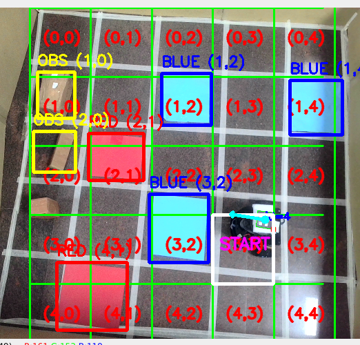
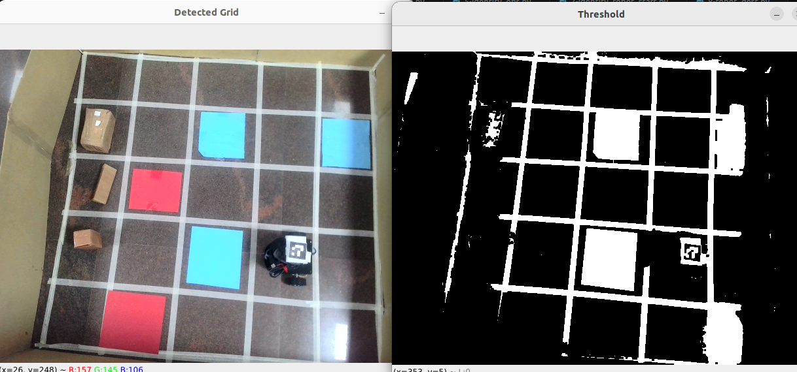

# Vision-Based Arena Mapping and Robot Localization

A computer vision system for detecting a **5×5 arena**, generating an **occupancy grid**, identifying **obstacles and bonus objects**, localizing a robot using **ArUco markers**, estimating robot orientation, and selecting navigation goals interactively.

<p align="center">
  
</p>

---

## Features

### Arena Detection
- Automatically detects the arena boundary from a camera feed.
- Divides the arena into a **5×5 grid**.
- Labels each cell with `(row, col)` coordinates.

### Occupancy Grid Generation
Creates a 5×5 occupancy matrix:

| Value | Meaning |
|---------|---------|
| 0 | Empty Cell |
| 1 | Obstacle |
| 2 | Blue Bonus |
| 3 | Red Bonus |


<p align="center">
  
</p>


---

### Object Detection

#### Blue Bonus Detection
Detects blue-colored bonus objects using HSV thresholding.

#### Red Bonus Detection
Detects red-colored bonus objects using HSV thresholding.

#### Obstacle Detection
Detects brown-colored obstacles and maps them to grid cells.

---

### Robot Localization

Uses an **ArUco Marker** mounted on the robot.

Features:
- Detect robot position
- Detect robot grid cell
- Detect robot orientation
- Display heading arrow
- Mark robot start position

Supported marker family:

```python
DICT_4X4_50
```

Any marker ID from the dictionary can be used.

---

### Interactive Goal Selection

Click anywhere inside the arena to select a destination cell.

Features:
- Mouse-click goal selection
- Goal cell highlighting
- Goal coordinate extraction
- Arena state update on goal change

---

## Example Arena Representation

```python
{
    "blue_bonus": [(0, 4)],
    "red_bonus": [(2, 1)],
    "obstacles": [(3, 3)],
    "start": (4, 0),
    "goal": (1, 4)
}
```

---

## Example Occupancy Matrix

```text
========================================
          OCCUPANCY MATRIX
========================================
      0  1  2  3  4

Row 0: [0, 0, 0, 2, 0]
Row 1: [0, 1, 0, 0, G]
Row 2: [0, 3, 0, 0, 0]
Row 3: [0, 0, 0, 1, 0]
Row 4: [S, 0, 0, 0, 0]

========================================
```

---

## Technologies Used

- Python
- OpenCV
- NumPy
- OpenCV ArUco Module

---

## Installation

Clone the repository:

```bash
git clone https://github.com/<your-username>/<repo-name>.git
cd <repo-name>
```

Install dependencies:

```bash
pip install opencv-contrib-python numpy
```

---

## Run

```bash
python arena_mapping.py
```

---

## Controls

| Action | Description |
|----------|-------------|
| Left Mouse Click | Select Goal Cell |
| Q | Quit Application |

---

## Visualization

The system displays:

- Arena boundary
- 5×5 grid
- Cell coordinates
- Blue bonuses
- Red bonuses
- Obstacles
- Robot position
- Robot orientation arrow
- START cell
- GOAL cell

---

## Future Improvements

- A* Path Planning
- Dijkstra Path Planning
- BFS Path Planning
- Real Robot Navigation
- ROS2 Integration
- Multi-Robot Support
- MQTT Communication
- Dynamic Obstacle Avoidance

---

## Author

Pulkit Garg

Robotics | Computer Vision | Autonomous Navigation